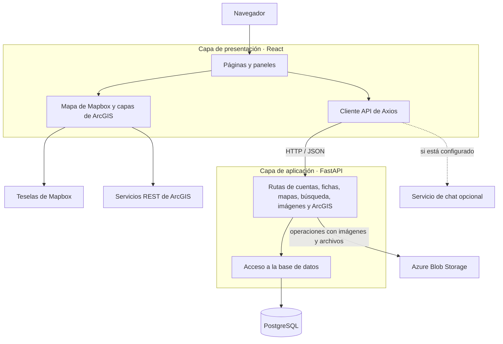

<p align="center">
  <strong>Idioma:</strong>
  <a href="README.md">en</a> ·
  <a href="README.es.md">es</a> ·
  <a href="README.zh-CN.md">zh-CN</a>
</p>

<div align="center">
  

  <h1>RWC Living Atlas</h1>

  <p><strong>Explora proyectos ambientales, datos y capas de mapas en un solo lugar.</strong></p>

  <p>Un atlas web para descubrir y compartir investigaciones de la cuenca del río Columbia.</p>
</div>

<p align="center">
  <a href="#funciones">Funciones</a> ·
  <a href="#arquitectura">Arquitectura</a> ·
  <a href="#primeros-pasos">Primeros pasos</a> ·
  <a href="#estructura-del-proyecto">Estructura del proyecto</a> ·
  <a href="#contribuciones">Contribuciones</a>
</p>

## Descripción general

RWC Living Atlas reúne fichas de proyectos ambientales y capas geoespaciales en un mapa interactivo. Quienes visitan el sitio pueden explorar y filtrar proyectos; quienes contribuyen pueden enviar fichas y archivos relacionados; y quienes administran la aplicación pueden gestionar cuentas y contenido. La aplicación se desarrolló en colaboración con el Center for Environmental Research, Education, and Outreach (CEREO) de Washington State University.

## Funciones

| Explorar | Contribuir | Administrar |
| --- | --- | --- |
| Consultar fichas de proyectos y marcadores en el mapa | Crear y editar fichas con ubicaciones, descripciones, imágenes y enlaces | Revisar solicitudes de cuentas y administrar usuarios |
| Buscar y filtrar por categoría, etiquetas y área del mapa | Agregar ubicaciones de puntos y polígonos | Mantener los listados de servicios ArcGIS y las capas personalizadas |
| Ver capas de ArcGIS junto con mapas base de Mapbox | Guardar selecciones de capas y marcadores de favoritos | Consultar resúmenes del atlas |

La interfaz también incluye un asistente conversacional opcional. Requiere un servicio independiente configurado por separado; la aplicación principal de FastAPI de este repositorio no ofrece `/chat/ask`.

## Arquitectura

El diagrama muestra las capas principales de ejecución y el flujo de datos. Los servicios externos de mapas y almacenamiento se usan en funciones concretas, por lo que no intervienen en todas las solicitudes a la API.



**Tecnologías:** React 18, React Router, Mapbox GL JS, FastAPI, PostgreSQL y, de forma opcional, Azure Blob Storage. El frontend está configurado para Netlify en [`netlify.toml`](netlify.toml). Las rutas del backend y la lógica de inicio de la base de datos se encuentran en [`main.py`](LivingAtlas1-main/backend/main.py) y [`database.py`](LivingAtlas1-main/backend/database.py).

## Primeros pasos

### Requisitos previos

- Python 3.12 y `pip`
- Node.js y `npm`
- PostgreSQL con la herramienta de línea de comandos `psql`
- Acceso a la red para las teselas de Mapbox y las capas activas de ArcGIS

El repositorio no tiene un comando único de instalación. Inicia primero la base de datos y el backend; después, abre otra terminal para el frontend.

### 1. Preparar una base de datos local

Crea una **base de datos PostgreSQL local vacía** y aplica el esquema base. Desde la raíz del repositorio, por ejemplo:

```sh
createdb livingatlas_dev
psql -d livingatlas_dev -f LivingAtlas1-main/database/database_schema/livingAtlasTables.sql
```

Usa la configuración de autenticación habitual de tu usuario de PostgreSQL. El backend aplica cambios adicionales e idempotentes al esquema durante el inicio; por eso, utiliza una base de datos local desechable para desarrollar. Los archivos de [`LivingAtlas1-main/database`](LivingAtlas1-main/database) contienen el esquema base y el historial de migraciones; los datos de ejemplo son opcionales.

### 2. Iniciar el backend

```sh
cd LivingAtlas1-main/backend
python -m venv .venv
```

Activa el entorno con `source .venv/bin/activate` en macOS/Linux o `.\.venv\Scripts\Activate.ps1` en PowerShell. Después, instala las dependencias:

```sh
python -m pip install -r requirements.txt
```

Define las variables de la base de datos en la terminal antes de iniciar el servidor. `DATABASE_URL` tiene prioridad; de lo contrario, el backend necesita `DB_NAME`, `DB_USER`, `DB_PASSWORD` y `DB_HOST`. `DB_PORT` usa `5432` de forma predeterminada; establece `DB_SSLMODE=disable` si tu PostgreSQL local no utiliza TLS. Mantén las credenciales en tu entorno local y fuera de Git.

```sh
uvicorn main:app --reload
```

La API se ejecuta en <http://localhost:8000>; la documentación interactiva de los endpoints está en <http://localhost:8000/docs>. Una respuesta de `/` confirma que el servidor está activo, mientras que las rutas que consultan la base de datos, como `/allCards`, permiten comprobar la conexión y el esquema.

### 3. Iniciar el frontend

En otra terminal, desde la raíz del repositorio:

```sh
cd LivingAtlas1-main/client
npm install
npm start
```

Abre <http://localhost:3000>. **Configuración actual:** [`client/src/api.js`](LivingAtlas1-main/client/src/api.js) apunta de forma predeterminada al backend alojado. Iniciar un backend local no redirige automáticamente las solicitudes del frontend. Para desarrollar todo el sistema en local, configura el `baseURL` de Axios como `http://localhost:8000` en tu copia local y revisa el cambio antes de incluirlo en un commit. El asistente opcional puede usar `REACT_APP_CHATBOT_API_URL` para acceder a un servicio independiente.

Algunas funciones necesitan servicios externos: las teselas de mapas y las capas de ArcGIS requieren acceso a la red; la carga de imágenes y archivos puede necesitar credenciales de Azure Blob Storage. La navegación básica depende de que la base de datos contenga datos.

## Estructura del proyecto

```text
.
├── LivingAtlas1-main/
│   ├── client/                 # Aplicación React e interfaz del mapa
│   │   ├── public/             # Recursos estáticos
│   │   └── src/                # Páginas, componentes y cliente API
│   ├── backend/                # Aplicación FastAPI, rutas y dependencias
│   │   └── endpoint_files/     # Rutas de API por función
│   └── database/               # Esquema base, datos de ejemplo y migraciones
├── documentation/              # Informes y documentación del proyecto
├── netlify.toml                # Configuración de compilación del frontend
└── LICENSE.txt
```

## Desarrollo y ayuda

- Scripts del frontend: ejecuta `npm test` o `npm run build` desde [`LivingAtlas1-main/client`](LivingAtlas1-main/client). De forma predeterminada, el comando de pruebas inicia el ejecutor interactivo de Create React App.
- Referencia de la API: inicia el backend y abre <http://localhost:8000/docs>.
- Contexto del proyecto: consulta la carpeta [`documentation/`](documentation/) y el [manual de usuario integrado](LivingAtlas1-main/client/src/UserManual.js).
- Informa de errores o solicita funciones mediante [GitHub Issues](https://github.com/YaruG1022/RWC-Living-Atlas/issues). Incluye los pasos para reproducir el problema y los registros pertinentes del frontend o backend. Elimina credenciales y datos personales antes de compartir registros.

## Contribuciones

Abre un issue para comentar los cambios importantes y después envía un pull request centrado en ellos. Incluye una breve descripción del comportamiento, cómo lo comprobaste y capturas de pantalla si cambió la interfaz. No incluyas en los commits archivos del entorno local, archivos de la base de datos ni credenciales de servicios.

## Licencia

Este repositorio se distribuye bajo los términos de [`LICENSE.txt`](LICENSE.txt).
