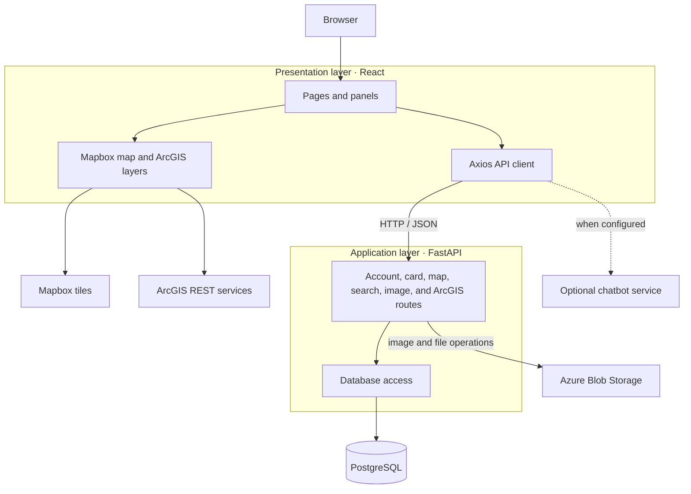

<p align="center">
  <strong>Language:</strong>
  <a href="README.md">en</a> ·
  <a href="README.es.md">es</a> ·
  <a href="README.zh-CN.md">zh-CN</a>
</p>

<div align="center">
  

  <h1>RWC Living Atlas</h1>

  <p><strong>Explore environmental projects, data, and map layers in one place.</strong></p>

  <p>A web atlas for discovering and sharing research across the Columbia River Basin.</p>
</div>

<p align="center">
  <a href="#features">Features</a> ·
  <a href="#architecture">Architecture</a> ·
  <a href="#getting-started">Getting started</a> ·
  <a href="#project-structure">Project structure</a> ·
  <a href="#contributing">Contributing</a>
</p>

## Overview

RWC Living Atlas brings environmental project cards and geospatial layers into an interactive map. Visitors can explore and filter projects; contributors can submit cards and related files; administrators can manage accounts and content. The application was developed in collaboration with Washington State University's Center for Environmental Research, Education, and Outreach (CEREO).

## Features

| Explore | Contribute | Manage |
| --- | --- | --- |
| Browse project cards and map markers | Create and edit cards with locations, descriptions, images, and links | Review account requests and administer users |
| Search and filter by category, tags, and map area | Add point and polygon locations | Maintain ArcGIS service listings and custom layers |
| View ArcGIS layers alongside Mapbox basemaps | Save layer selections and bookmarks | View atlas summaries |

The interface also includes an optional helper chatbot. It needs a separately configured chatbot service; the main FastAPI application in this repository does not provide `/chat/ask`.

## Architecture

The diagram shows the main runtime layers and their data flow. External map and storage services are used by specific features, so they are not required for every API request.



**Stack:** React 18, React Router, Mapbox GL JS, FastAPI, PostgreSQL, and optional Azure Blob Storage. The frontend is configured for Netlify in [`netlify.toml`](netlify.toml). Backend routes and database startup logic are in [`main.py`](LivingAtlas1-main/backend/main.py) and [`database.py`](LivingAtlas1-main/backend/database.py).

## Getting started

### Prerequisites

- Python 3.12 and `pip`
- Node.js and `npm`
- PostgreSQL with the `psql` command-line tool
- Network access for Mapbox tiles and live ArcGIS layers

The repository has no one-command setup. Start the database and backend first, then the frontend in a second terminal.

### 1. Prepare a local database

Create an **empty local PostgreSQL database** and apply the base schema. From the repository root, for example:

```sh
createdb livingatlas_dev
psql -d livingatlas_dev -f LivingAtlas1-main/database/database_schema/livingAtlasTables.sql
```

Use your PostgreSQL user's normal authentication settings. The backend applies additional idempotent schema changes at startup, so use a disposable local database while developing. The files under [`LivingAtlas1-main/database`](LivingAtlas1-main/database) contain the base schema and migration history; sample data is optional.

### 2. Start the backend

```sh
cd LivingAtlas1-main/backend
python -m venv .venv
```

Activate the environment with `source .venv/bin/activate` on macOS/Linux or `.\.venv\Scripts\Activate.ps1` in PowerShell. Then install dependencies:

```sh
python -m pip install -r requirements.txt
```

Set the database variables in your shell before starting the server. `DATABASE_URL` takes precedence; otherwise the backend needs `DB_NAME`, `DB_USER`, `DB_PASSWORD`, and `DB_HOST`. `DB_PORT` defaults to `5432`; set `DB_SSLMODE=disable` for a local PostgreSQL server that does not use TLS. Keep credentials in your local environment and out of Git.

```sh
uvicorn main:app --reload
```

The API runs at <http://localhost:8000>; interactive endpoint docs are at <http://localhost:8000/docs>. A response from `/` confirms the server is running, while database-backed routes such as `/allCards` confirm the database connection and schema.

### 3. Start the frontend

In another terminal, from the repository root:

```sh
cd LivingAtlas1-main/client
npm install
npm start
```

Open <http://localhost:3000>. **Current configuration:** [`client/src/api.js`](LivingAtlas1-main/client/src/api.js) points to the hosted backend by default. Starting a local backend alone does not redirect frontend requests to it. For full local development, configure that Axios `baseURL` for `http://localhost:8000` in your local checkout and review the change before committing. The optional chatbot can use `REACT_APP_CHATBOT_API_URL` to reach a separate service.

Some features need external services: map tiles and ArcGIS layers need network access, while image/file uploads may need Azure Blob Storage credentials. Basic browsing depends on the database being populated.

## Project structure

```text
.
├── LivingAtlas1-main/
│   ├── client/                 # React application and map interface
│   │   ├── public/             # Static assets
│   │   └── src/                # Pages, components, and API client
│   ├── backend/                # FastAPI app, routers, and dependencies
│   │   └── endpoint_files/     # Feature-specific API routes
│   └── database/               # Base schema, sample data, and migrations
├── documentation/              # Reports and project documents
├── netlify.toml                # Frontend build configuration
└── LICENSE.txt
```

## Development and support

- Frontend scripts: run `npm test` or `npm run build` from [`LivingAtlas1-main/client`](LivingAtlas1-main/client). The test command starts Create React App's interactive runner by default.
- API reference: run the backend and open <http://localhost:8000/docs>.
- Project background: see the [`documentation/`](documentation/) folder and the [in-app user manual](LivingAtlas1-main/client/src/UserManual.js).
- Report a bug or request a feature through [GitHub Issues](https://github.com/YaruG1022/RWC-Living-Atlas/issues), including reproduction steps and the relevant frontend or backend logs. Remove credentials and personal data before sharing logs.

## Contributing

Open an issue to discuss substantial changes, then submit a focused pull request. Include a short description of the behavior, how you checked it, and screenshots for visible UI changes. Keep local environment files, database files, and service credentials out of commits.

## License

This repository is licensed under the terms in [`LICENSE.txt`](LICENSE.txt).
