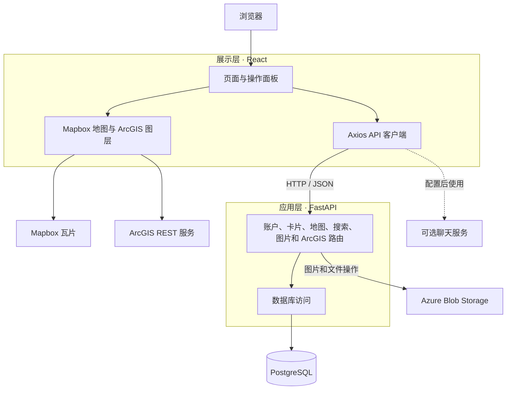

<p align="center">
  <strong>语言：</strong>
  <a href="README.md">en</a> ·
  <a href="README.es.md">es</a> ·
  <a href="README.zh-CN.md">zh-CN</a>
</p>

<div align="center">
  

  <h1>RWC Living Atlas</h1>

  <p><strong>在同一平台探索环境项目、数据与地图图层。</strong></p>

  <p>一个用于发现和共享哥伦比亚河流域研究成果的网络地图集。</p>
</div>

<p align="center">
  <a href="#功能">功能</a> ·
  <a href="#架构">架构</a> ·
  <a href="#快速开始">快速开始</a> ·
  <a href="#项目结构">项目结构</a> ·
  <a href="#参与贡献">参与贡献</a>
</p>

## 项目简介

RWC Living Atlas 将环境项目卡片和地理空间图层汇集在交互式地图中。访客可以浏览和筛选项目；贡献者可以提交项目卡片及相关文件；管理员可以管理账户和内容。本应用与华盛顿州立大学的环境研究、教育与推广中心（Center for Environmental Research, Education, and Outreach，CEREO）合作开发。

## 功能

| 探索 | 贡献 | 管理 |
| --- | --- | --- |
| 浏览项目卡片和地图标记 | 创建、编辑包含位置、描述、图片和链接的卡片 | 审核账户申请并管理用户 |
| 按类别、标签和地图范围搜索筛选 | 添加点和多边形位置 | 维护 ArcGIS 服务列表和自定义图层 |
| 在 Mapbox 底图上查看 ArcGIS 图层 | 保存图层选择和收藏的卡片 | 查看地图集汇总信息 |

界面还包含可选的辅助聊天机器人。它需要单独配置的聊天服务；本仓库的 FastAPI 主应用不提供 `/chat/ask` 接口。

## 架构

下图展示主要运行层及数据流。外部地图和存储服务只用于部分功能，并非每个 API 请求都依赖它们。



**技术栈：**React 18、React Router、Mapbox GL JS、FastAPI、PostgreSQL，以及可选的 Azure Blob Storage。前端的 Netlify 构建配置位于 [`netlify.toml`](netlify.toml)；后端路由和数据库启动逻辑分别位于 [`main.py`](LivingAtlas1-main/backend/main.py) 与 [`database.py`](LivingAtlas1-main/backend/database.py)。

## 快速开始

### 环境要求

- Python 3.12 和 `pip`
- Node.js 和 `npm`
- PostgreSQL，以及 `psql` 命令行工具
- 可访问 Mapbox 瓦片和在线 ArcGIS 图层的网络连接

仓库目前没有一键启动脚本。先启动数据库和后端，再在另一个终端启动前端。

### 1. 准备本地数据库

创建一个**空的本地 PostgreSQL 数据库**并导入基础表结构。例如，在仓库根目录执行：

```sh
createdb livingatlas_dev
psql -d livingatlas_dev -f LivingAtlas1-main/database/database_schema/livingAtlasTables.sql
```

使用你的 PostgreSQL 用户常规的身份验证方式。后端启动时会应用额外的、可重复执行的表结构变更，因此开发时请使用可丢弃的本地数据库。[`LivingAtlas1-main/database`](LivingAtlas1-main/database) 包含基础表结构和迁移历史；示例数据可按需导入。

### 2. 启动后端

```sh
cd LivingAtlas1-main/backend
python -m venv .venv
```

macOS/Linux 使用 `source .venv/bin/activate` 激活虚拟环境；PowerShell 使用 `.\.venv\Scripts\Activate.ps1`。随后安装依赖：

```sh
python -m pip install -r requirements.txt
```

启动服务前，在当前终端配置数据库环境变量。`DATABASE_URL` 的优先级最高；如未设置，则需要提供 `DB_NAME`、`DB_USER`、`DB_PASSWORD` 和 `DB_HOST`。`DB_PORT` 默认是 `5432`；本地 PostgreSQL 未启用 TLS 时，请设置 `DB_SSLMODE=disable`。凭据应保存在本地环境中，不要提交到 Git。

```sh
uvicorn main:app --reload
```

API 地址为 <http://localhost:8000>，交互式接口文档位于 <http://localhost:8000/docs>。根路径 `/` 有响应只能说明服务已运行；还应访问 `/allCards` 等需要数据库的接口，确认连接和表结构正常。

### 3. 启动前端

打开另一个终端，从仓库根目录执行：

```sh
cd LivingAtlas1-main/client
npm install
npm start
```

浏览器访问 <http://localhost:3000>。**当前配置：**[`client/src/api.js`](LivingAtlas1-main/client/src/api.js) 默认指向托管后端，仅启动本地后端不会自动切换前端请求。若要进行完整的本地开发，需要在本地检出中将 Axios 的 `baseURL` 配置为 `http://localhost:8000`，并在提交前检查该改动。可选的聊天机器人可以通过 `REACT_APP_CHATBOT_API_URL` 连接独立服务。

部分功能依赖外部服务：地图瓦片和 ArcGIS 图层需要网络连接；图片或文件上传可能需要 Azure Blob Storage 凭据。基础浏览功能需要数据库中已有数据。

## 项目结构

```text
.
├── LivingAtlas1-main/
│   ├── client/                 # React 应用与地图界面
│   │   ├── public/             # 静态资源
│   │   └── src/                # 页面、组件与 API 客户端
│   ├── backend/                # FastAPI 应用、路由与依赖
│   │   └── endpoint_files/     # 按功能组织的 API 路由
│   └── database/               # 基础表结构、示例数据与迁移
├── documentation/              # 项目报告与文档
├── netlify.toml                # 前端构建配置
└── LICENSE.txt
```

## 开发与支持

- 前端命令：在 [`LivingAtlas1-main/client`](LivingAtlas1-main/client) 中运行 `npm test` 或 `npm run build`。默认情况下，测试命令会启动 Create React App 的交互式测试运行器。
- API 参考：启动后端后访问 <http://localhost:8000/docs>。
- 项目背景：参阅 [`documentation/`](documentation/) 目录和[应用内用户手册](LivingAtlas1-main/client/src/UserManual.js)。
- 发现问题或希望新增功能时，请通过 [GitHub Issues](https://github.com/YaruG1022/RWC-Living-Atlas/issues) 反馈，附上复现步骤以及相关的前端或后端日志。分享日志前请移除凭据和个人信息。

## 参与贡献

较大的改动请先通过 issue 讨论，再提交聚焦单一主题的 pull request。请简述改动后的行为、验证方式；涉及界面变化时附上截图。不要提交本地环境文件、数据库文件或服务凭据。

## 许可证

本仓库遵循 [`LICENSE.txt`](LICENSE.txt) 中的许可条款。
