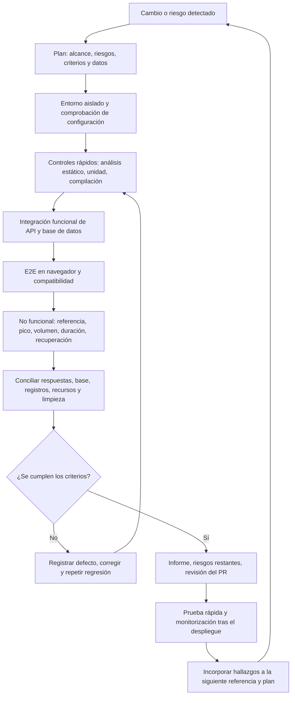

# Estrategia de pruebas de ingeniería de Living Atlas

[en-US](TEST_STRATEGY.md) · [es-ES](TEST_STRATEGY.es-ES.md) · [zh-CN](TEST_STRATEGY.zh-CN.md)

Versión: edición inicial del 2026-09-26. Alcance: frontend React, backend FastAPI, base de datos PostgreSQL y despliegue en Netlify/Render de este repositorio. Este documento es una estrategia y un inventario de cobertura. Las pruebas planificadas no se presentan como realizadas. Los resultados del ciclo completado están en el [informe de pruebas locales](../LivingAtlas1-main/backend/load_tests/TEST_REPORT.es-ES.md).

## 1. Objetivos, alcance y criterios de calidad

Verificar continuamente que los recorridos críticos funcionan, que el registro y los datos siguen siendo consistentes, que los cambios pueden publicarse con seguridad y que el servicio se recupera de los fallos. Medir el rendimiento en un entorno representativo del tráfico real antes de afirmar una capacidad. Priorizar según el impacto en usuarios, el riesgo de pérdida de datos, el alcance del cambio y los defectos anteriores. Las áreas de mayor riesgo son el registro, las lecturas y filtros de mapas y tarjetas, la carga y eliminación de archivos, las conexiones a la base, la configuración frontend/backend y las migraciones de inicio.

Distinguir los **niveles de prueba** (unidad, componente, integración de API/base de datos, E2E de sistema y aceptación) de los **tipos de prueba** (funcionales y no funcionales). Una prueba puede cubrir varios tipos: el registro concurrente, por ejemplo, evalúa el comportamiento de negocio, la seguridad ante concurrencia y la integridad de datos. Registrar entorno, versión, carga, criterio de comprobación y límites, no solo «pasó».

El proyecto aún no tiene SLO de producción aprobados por responsables, un objetivo de usuarios concurrentes, una duración del pico ni una distribución de datos representativa. El p95 y el rendimiento locales son referencias comparativas, **no compromisos de capacidad de producción**. Definir indicadores de éxito, latencia, frescura de datos y disponibilidad antes de convertir las mediciones en umbrales de lanzamiento.

## 2. Ciclo de pruebas y lanzamiento

Implementar un script, ejecutarlo, conciliar sus resultados y corregir problemas antes de empezar el siguiente. Conservar evidencia tanto del fallo inicial como de la regresión posterior. Confirmar scripts, correcciones y reportes en commits lógicos y revisables. Incluir el informe y los riesgos no resueltos en el PR. Verificar el despliegue real después de integrar los cambios; un estado verde en GitHub no demuestra por sí solo que el recorrido de producción funcione.

| Etapa | Entregables | Criterio de salida |
|---|---|---|
| Planificación | Lista de riesgos, matriz de pruebas, plan de entorno/datos/umbrales y estimación | Alcance y exclusiones explícitos; acciones destructivas limitadas a una base de prueba. |
| Entorno | SHA de Git, versiones, URL frontend/backend, nombre de base y consulta de comprobación | Frontend conectado a API local; backend conectado a base aislada; secretos de producción fuera de registros. |
| Implementación y ejecución | Scripts repetibles, prefijo único, resultados originales y registros de app/BD | Sin fallos inesperados; respuestas concordantes con datos persistidos; fallos conservados y clasificados. |
| Corrección y regresión | Causa raíz, commit, reproducer y regresión cercana | El defecto no se reproduce; no aparecen regresiones relacionadas; los problemas intermitentes siguen visibles. |
| Cierre y lanzamiento | Informe, riesgos, controles del PR y plan de reversión | Sin datos de prueba residuales; configuración y migraciones revisadas; evidencia tras el lanzamiento. |

## 3. Entornos y datos de prueba

| Entorno | Propósito | Condiciones y límites |
|---|---|---|
| Local aislado | Regresión de desarrollo, depuración de scripts, inyección de fallos y volumen controlado | React `localhost:3000`, FastAPI `127.0.0.1:8000`, PostgreSQL `livingatlas_test`. Seguir la [guía local](../LivingAtlas1-main/backend/LOCAL_TESTING.es-ES.md). Nunca usar la base de producción para pruebas de escritura o carga. |
| CI/vista previa del PR (planificado) | Análisis estático, unidad, integración, compilación y E2E de solo lectura automatizados | Usar base efímera y datos aislados. Un control verde debe corresponder a una prueba ejecutada; vistas previas neutras o canceladas no cuentan como correctas. |
| Staging representativo (planificado) | Capacidad, distribución realista de datos, resiliencia y ensayo de reversión | Recursos Render, tamaño e índices de base y datos anonimizados similares a producción. Acordar carga y SLO antes de evaluar capacidad. |
| Producción | Comprobaciones rápidas de bajo impacto y monitorización después del despliegue | Sin alta concurrencia, limpieza de base ni inyección de fallos. Verificar despliegue Netlify/Render, migraciones y recorridos críticos. |

Usar datos sintéticos o desidentificados. Asignar a cada ejecución un prefijo único e ID auditables; conciliar filas y restricciones antes y después y limpiar por prefijo. Inyectar fallos solo en un entorno de prueba dedicado. Indicar si ArcGIS, Mapbox, Azure y otras dependencias externas están activas, simuladas o excluidas. No atribuir a la capacidad de esta app la variabilidad de terceros sin evidencia.

## 4. Pruebas completadas y evidencia trazable

«Completado» solo se refiere a ejecuciones locales del 2026-09-26. Comandos, métricas, fallos iniciales, correcciones y límites están en [TEST_REPORT.es-ES.md](../LivingAtlas1-main/backend/load_tests/TEST_REPORT.es-ES.md). Las instrucciones están en [load_tests/README.es-ES.md](../LivingAtlas1-main/backend/load_tests/README.es-ES.md).

| ID | Tipo / nivel | Escenario y comprobación | Estado y evidencia | Defecto descubierto / trabajo pendiente |
|---|---|---|---|---|
| 1 | Funcional: registro e integridad; no funcional: concurrencia; integración API+BD | Registros simultáneos con correos distintos/iguales; comparar respuestas, filas y unicidad de `SignupID` y correo. | Completado: [script](../LivingAtlas1-main/backend/load_tests/01_registration_concurrency.py), [informe §1 y restricciones](../LivingAtlas1-main/backend/load_tests/TEST_REPORT.es-ES.md). | Carrera en `MAX+1`. Se sustituyó por una secuencia; los índices únicos se crean cuando los datos históricos lo permiten. Auditar duplicados en producción. |
| 2 | No funcional: carga de referencia; funcional: regresión de lecturas; sistema API+BD | Registro y cuatro rutas de lectura con 5/10/20 usuarios; conciliar respuestas, latencia y datos. | Completado: [script](../LivingAtlas1-main/backend/load_tests/02_baseline_load.py), [informe §2](../LivingAtlas1-main/backend/load_tests/TEST_REPORT.es-ES.md). | Esperas por DDL durante solicitudes, cursor compartido y un tiempo de espera intermitente. Se modificaron las rutas principales. |
| 3 | No funcional: pico y recuperación; sistema API+BD | Cambio breve de 5→50→5 usuarios; medir errores, p95/p99 y recuperación. | Completado: [script](../LivingAtlas1-main/backend/load_tests/03_spike.py), [informe §3](../LivingAtlas1-main/backend/load_tests/TEST_REPORT.es-ES.md). | Una regresión posterior tuvo tiempos de espera intermitentes de 15 segundos. El pico breve no establece capacidad sostenida. |
| 4 | No funcional: volumen/rendimiento; funcional: paginación; sistema API+BD | 100/1.000/5.000 tarjetas, respuestas completas y dos primeras páginas; comprobar filas e ID duplicados. | Completado: [script](../LivingAtlas1-main/backend/load_tests/04_data_volume.py), [informe §4](../LivingAtlas1-main/backend/load_tests/TEST_REPORT.es-ES.md). | Creció el coste de respuestas completas. Se añadió paginación opcional; el frontend todavía descarga todo y no se midió el renderizado. |
| 5a | No funcional: estabilidad/duración; sistema API+BD | Cinco minutos de solicitudes mixtas; éxito, latencia, conexiones y limpieza. | Completado: [script](../LivingAtlas1-main/backend/load_tests/05a_soak.py), [informe §5](../LivingAtlas1-main/backend/load_tests/TEST_REPORT.es-ES.md). | La implementación anterior corrió 300 segundos; los cambios posteriores solo tuvieron 60 segundos de regresión combinada. Repetir la prueba completa. |
| 5b | No funcional: resiliencia/recuperación; funcional: transacciones; sistema API+BD | Terminar sesiones dedicadas de BD; comprobar lecturas consecutivas y registro. | Completado: [script](../LivingAtlas1-main/backend/load_tests/05b_connection_recovery.py), [informe §5 y pool](../LivingAtlas1-main/backend/load_tests/TEST_REPORT.es-ES.md). | Las primeras solicitudes fallaban antes de la corrección. Rutas principales y registro ahora usan pool. Faltan rutas heredadas, caída completa de BD y transacciones interrumpidas. |

También existen la [prueba frontend `main.test.js`](../LivingAtlas1-main/client/src/__tests__/main.test.js) y la [prueba backend de carga/eliminación Azure](../LivingAtlas1-main/backend/tests/test_azure_upload_delete.py). No se ejecutaron ni evaluaron en este ciclo y no cuentan como resultados correctos.

## 5. Matriz de pruebas planificadas

| Tipo | Prioridad | Escenario y resultado observable | Automatización sugerida |
|---|---|---|---|
| Funcional: registro/autenticación/autorización | Alta | Límites de entrada, correos duplicados y con distinta capitalización, escalada de privilegios, sesiones caducadas y acceso no autorizado; verificar estado e invariantes de BD. | Unidad + integración API + E2E seleccionados. |
| Funcional: tarjetas y mapas | Alta | Crear/editar/eliminar, filtros combinados, orden y páginas, resultados vacíos, coherencia entre lista y mapa, cambios simultáneos. | Integración API/BD + E2E en navegador. |
| Funcional: archivos e integraciones | Alta | Límites de tamaño/tipo, reversión al eliminar, fallos de Azure, respuestas ArcGIS malformadas, tiempos de espera Mapbox; sin archivos o filas huérfanos. | Contrato + integración. |
| Funcional: recorridos de usuario | Alta | Registro → inicio de sesión → mapa → filtro → detalle → carga/edición; verificar configuración frontend/backend. | Automatización en navegador como Playwright; solo comprobación de bajo impacto en producción. |
| No funcional: seguridad | Alta | Derivar controles de [OWASP ASVS](https://owasp.org/projects/asvs): autenticación, autorización, inyección SQL, XSS, cargas, secretos y dependencias. | Análisis estático/dependencias + pruebas de seguridad API + revisión humana. |
| No funcional: migraciones/integridad | Alta | ID/correos históricos duplicados, migración de tablas grandes, reinicio idempotente, inicio simultáneo de procesos, copia de seguridad/reversión. | Integración con BD aislada + ensayo en staging. |
| No funcional: rendimiento/capacidad | Alta | Carga escalonada, pico sostenido, límites, telemetría de cuellos de botella y pool con datos y mezcla realistas. | Herramienta de carga en staging dedicado. |
| No funcional: resiliencia | Alta | Ejecución prolongada, caída breve de toda la BD, transacción interrumpida, fallo de terceros, reintentos y tiempo de recuperación. | Inyección de fallos en staging + monitorización. |
| No funcional: accesibilidad | Media | Teclado, foco, comentarios de formularios, contraste, alternativas al mapa; elegir nivel de [WCAG 2.2](https://www.w3.org/TR/WCAG22/). | Escaneo automático + comprobación manual con tecnología de asistencia. |
| No funcional: compatibilidad/adaptación | Media | Navegadores principales, pantallas móviles, redes lentas e interacción con mapas. | E2E multidispositivo/navegador + revisión visual. |
| No funcional: usabilidad/observabilidad | Media | Finalización de tareas, errores frontend, correlación de registros API, panel SLO y alertas. | Estudios con personas + comprobaciones de monitorización. |

Orden sugerido: reforzar primero la regresión rápida de registro e integración con BD; después cubrir E2E críticos y migraciones; luego preparar cargas representativas en staging; por último ampliar pruebas largas y de fallos combinados. Ejecutar cada nueva automatización a pequeña escala y registrar resultados reales antes de convertirla en requisito de CI.

## 6. Decisiones, defectos y formato de informe

- **Criterio funcional de salida:** Sin fallos inesperados en recorridos críticos. Contar por separado los rechazos de negocio esperados. Respuestas HTTP, estado de BD y efectos secundarios concuerdan; no quedan datos de prueba. Los defectos de seguridad o corrupción de datos deben bloquear el lanzamiento hasta resolverse o ser aceptados explícitamente por la persona responsable.
- **Criterio de rendimiento:** Responsables de producto y operaciones deben aprobar primero SLIs/SLOs, modelo de usuarios, entorno objetivo, duración del pico y presupuesto de recursos. Después se fijan umbrales de éxito, p95/p99, rendimiento, conexiones, CPU y memoria. Hasta entonces, comparar tendencias sin afirmar cumplimiento de valores arbitrarios.
- **Registro de defecto:** Conservar pasos de reproducción, entorno/SHA, solicitudes representativas, esperado frente a real, registros, alcance, frecuencia y enlaces. Mantener visibles los tiempos de espera intermitentes: una repetición correcta no establece la causa raíz.
- **Campos del informe:** Objetivo y versión, alcance/exclusiones, entorno, dependencias, datos, comandos, curva de carga, muestras, percentiles y errores, conciliación y limpieza de BD, fallos/correcciones/regresión, riesgos, conclusión y revisor. El éxito total de solicitudes no basta.
- **Revisión de lanzamiento:** Inspeccionar diff y secretos, URL alternativa de API de Netlify, `DATABASE_URL` de Render, datos históricos y migraciones, controles del PR y reversión. Tras integrar, verificar el despliegue real y recorridos de usuario. Una vista previa cancelada no es una prueba correcta.

## 7. Cadencia y responsabilidades sugeridas

Es un objetivo futuro de ingeniería, no una afirmación de que CI ya ejecute estos controles. La persona responsable de pruebas ajusta el alcance según el riesgo de cada cambio; la responsable del lanzamiento decide si acepta el riesgo restante.

| Disparador | Ejecución sugerida | Responsable y evidencia conservada |
|---|---|---|
| Cambio de código relevante | Análisis estático, pruebas de unidad/componente afectadas, integración rápida API/BD. | Implementador: comandos, SHA y registros de fallos; regresión cercana después de corregir. |
| Cada PR | Compilación frontend, regresión crítica de registro/lectura, compatibilidad de migración, búsqueda de secretos. | Autor adjunta resultados y riesgos; revisor examina código, datos e informe. |
| Ejecución periódica o gran cambio de rendimiento | Volumen representativo, carga escalonada, pico, duración y tendencias de conexiones/recursos. | Responsable de pruebas compara referencias y variación, conserva muestras e investiga incumplimientos. |
| Antes de lanzar | E2E críticos, ensayo de migración/reversión en staging, capacidad y seguridad. | Responsable del lanzamiento confirma versión, entorno, SLO y reversión. |
| Después de lanzar | Comprobación de bajo impacto, despliegues y registros Netlify/Render, métricas y alertas. | Operaciones registra SHA desplegado y anomalías para el siguiente plan de riesgos. |

Para trazar requisitos a evidencia, asignar ID estables a casos nuevos (por ejemplo `REG-01`, `CARD-01`, `REL-01`). Enlazar requisito o defecto, ruta del script, SHA, resultado y seguimiento en PR/informe. Marcar explícitamente pruebas omitidas, no ejecutadas o no representativas; no contarlas como aprobadas.

## 8. Referencias metodológicas

El ciclo usa conceptos de planificación, análisis/diseño, implementación/ejecución, seguimiento/control y cierre de [ISTQB CTFL v4.0.1](https://www.istqb.org/certifications/certified-tester-foundation-level-ctfl-v4-0/). [ISO/IEC 25010:2023](https://www.iso.org/standard/78176.html) ofrece un modelo de calidad para planear la cobertura. Para seguridad y accesibilidad se consultan [OWASP ASVS](https://owasp.org/projects/asvs) y [W3C WCAG 2.2](https://www.w3.org/TR/WCAG22/). La [guía de Google SRE sobre SLO](https://sre.google/workbook/implementing-slos/) orienta futuros objetivos de fiabilidad en producción. Estas referencias guían el diseño de pruebas; no certifican esta aplicación.
