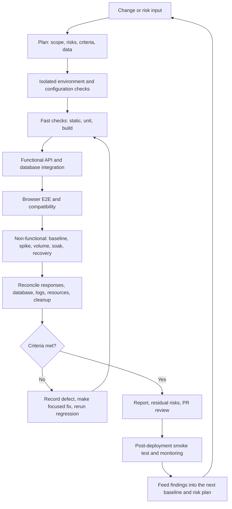

# Living Atlas Engineering Test Strategy

[EN-us](TEST_STRATEGY.md) · [CN-zh](TEST_STRATEGY.zh-CN.md)

Version: 2026-09-26 initial edition. Scope: this repository's React frontend, FastAPI backend, PostgreSQL database, and Netlify/Render deployment. This document is a strategy and coverage inventory. Planned tests are not represented as completed. Results from the completed cycle are in the [local test report](../LivingAtlas1-main/backend/load_tests/TEST_REPORT.md).

## 1. Objectives, scope, and quality criteria

Continuously verify that critical user journeys work, registration and data remain consistent, changes can be released safely, and the service recovers from faults. Measure performance in an environment representative of actual traffic before making capacity claims. Prioritize by user impact, data-loss risk, change scope, and prior defects. Current high-risk areas are signup, map/card reads and filtering, uploads and deletion, database connections, frontend/backend configuration, and startup migrations.

Distinguish **test levels** (unit, component, API/database integration, system E2E, and acceptance) from **test types** (functional and non-functional). A test may cover several types: concurrent signup, for example, tests business behavior, concurrency safety, and data integrity. Record the environment, version, workload, oracle, and limitations, rather than just “passed.”

The project does not yet have owner-approved production SLOs, target concurrent-user counts, peak duration, or representative data distribution. Local p95 and throughput are comparative baselines, **not production capacity commitments**. Define user-facing success, latency, data freshness, and availability indicators before turning measurements into release thresholds.

## 2. Engineering test and release cycle

Implement one test script, run it, reconcile the result, and fix problems before starting the next. Preserve both the initial failure and subsequent regression evidence. Commit scripts, product fixes, and reports in logical reviewable steps. Carry the report and unresolved risks into the PR. Verify the actual deployment after merging; a green GitHub status alone does not prove the production user journey works.

| Stage | Deliverables | Exit criterion |
|---|---|---|
| Planning | Risk list, test matrix, environment/data/threshold plan, estimated effort | Scope and exclusions are explicit; destructive actions are confined to a test database. |
| Environment | Git SHA, dependency versions, frontend/backend URLs, database name, query-based health check | Frontend targets the local API; backend targets the isolated DB; no production secrets enter test logs. |
| Implementation and execution | Repeatable scripts, unique data prefix, raw results, app/DB logs | No unexpected failures; responses match persisted state; failures are preserved and classified. |
| Fix and regression | Root cause, code commit, reproducer, adjacent regression | Defect no longer reproduces; related paths do not regress; intermittent issues remain visible risks. |
| Completion and release | Report, residual risks, PR checks, rollback plan | No test data remains; configuration and migrations are reviewed; post-release smoke evidence exists. |

## 3. Environments and test data

| Environment | Purpose | Entry conditions and limits |
|---|---|---|
| Isolated local environment | Development regression, script debugging, fault injection, controlled volume | React `localhost:3000`, FastAPI `127.0.0.1:8000`, PostgreSQL `livingatlas_test`. Follow the [local setup guide](../LivingAtlas1-main/backend/LOCAL_TESTING.md). Never use the production database for write or load tests. |
| CI/PR preview (planned) | Automated static, unit, integration, build, and read-only E2E smoke checks | Use an isolated ephemeral database and test data. A green check must correspond to a check that actually ran; neutral or canceled preview deployments are not passes. |
| Representative staging (planned) | Capacity, realistic data distributions, resilience, rollback rehearsal | Match production-like Render resources, database sizing and indexes, and anonymized data. Agree on workload and SLO before judging capacity. |
| Production | Low-impact smoke checks and monitoring after deployment | No high concurrency, database cleanup, or fault injection. Verify Netlify/Render deployment, migration logs, and critical user journeys. |

Use synthetic or de-identified data. Give each run a unique prefix and auditable IDs; reconcile rows and constraints before and after, then clean up by prefix. Fault injection belongs in a dedicated test environment. State whether ArcGIS, Mapbox, Azure, and other external dependencies are live, stubbed, or excluded. Do not attribute third-party variability to this application's capacity without evidence.

## 4. Completed tests and traceable evidence

“Completed” below refers only to local runs on 2026-09-26. Exact commands, metrics, first failures, fixes, and limitations are in [TEST_REPORT.md](../LivingAtlas1-main/backend/load_tests/TEST_REPORT.md). Execution instructions are in [load_tests/README.md](../LivingAtlas1-main/backend/load_tests/README.md).

| ID | Type / level | Scenario and oracle | Status and evidence | Defect exposed / remaining work |
|---|---|---|---|---|
| 1 | Functional: signup and data integrity; non-functional: concurrency; API+DB integration | Concurrent distinct/same-email signup; compare HTTP outcomes, rows, `SignupID`, and email uniqueness. | Completed: [script](../LivingAtlas1-main/backend/load_tests/01_registration_concurrency.py), [report §1 and constraint regression](../LivingAtlas1-main/backend/load_tests/TEST_REPORT.md#1-注册正确性与并发). | `MAX+1` ID race. Replaced with a sequence; unique indexes are created when historical data permits. Audit production duplicates. |
| 2 | Non-functional: baseline load; functional: read regression; API+DB system | Mixed signup and four read routes at 5/10/20 users; reconcile responses, latency, and data. | Completed: [script](../LivingAtlas1-main/backend/load_tests/02_baseline_load.py), [report §2](../LivingAtlas1-main/backend/load_tests/TEST_REPORT.md#2-基础负载). | Request-time DDL lock waits, shared-cursor contention, and one intermittent timeout. Core paths were changed. |
| 3 | Non-functional: traffic spike and recovery; API+DB system | Short 5→50→5-user change; measure errors, p95/p99, and recovery. | Completed: [script](../LivingAtlas1-main/backend/load_tests/03_spike.py), [report §3](../LivingAtlas1-main/backend/load_tests/TEST_REPORT.md#3-流量突增). | Later regression saw intermittent 15-second timeouts. A short spike cannot establish sustained peak capacity. |
| 4 | Non-functional: volume/performance; functional: pagination; API+DB system | 100/1,000/5,000 cards, full responses and first two pages; check row counts and duplicate IDs. | Completed: [script](../LivingAtlas1-main/backend/load_tests/04_data_volume.py), [report §4](../LivingAtlas1-main/backend/load_tests/TEST_REPORT.md#4-大量数据). | Full-response cost increased with volume. Optional API pagination was added; the frontend still fetches full data and browser rendering was not measured. |
| 5a | Non-functional: stability/soak; API+DB system | Five minutes of mixed requests; success, latency, connection count, and cleanup. | Completed: [script](../LivingAtlas1-main/backend/load_tests/05a_soak.py), [report §5](../LivingAtlas1-main/backend/load_tests/TEST_REPORT.md#5-持续运行与故障恢复). | Original implementation ran for 300 seconds; later changes received only a 60-second combined regression. Rerun the full soak test. |
| 5b | Non-functional: resilience/recovery; functional: transaction correctness; API+DB system | Terminate dedicated DB sessions; check consecutive reads and signup for automatic recovery. | Completed: [script](../LivingAtlas1-main/backend/load_tests/05b_connection_recovery.py), [report §5 and pool regression](../LivingAtlas1-main/backend/load_tests/TEST_REPORT.md#5-持续运行与故障恢复). | First requests failed before the fix. Core reads/signup now use a pool. Legacy module-level DB paths, whole-DB outages, and interrupted transactions remain uncovered. |

Other existing assets include the [frontend `main.test.js`](../LivingAtlas1-main/client/src/__tests__/main.test.js) and [backend Azure upload/delete test](../LivingAtlas1-main/backend/tests/test_azure_upload_delete.py). They were not executed or evaluated during this cycle and are not counted as passing results.

## 5. Planned test matrix

| Test type | Priority | Candidate scenario and observable outcome | Suggested automation level |
|---|---|---|---|
| Functional: signup/authentication/authorization | High | Input boundaries, duplicate/case-variant emails, privilege escalation, expired sessions, unauthorized access; verify status and DB invariants. | Unit + API integration + selected E2E. |
| Functional: cards and maps | High | Create/edit/delete cards, combined filters, sort/page behavior, empty results, list/map agreement, concurrent updates. | API/DB integration + browser E2E. |
| Functional: files and external integrations | High | Upload size/type limits, delete rollback, Azure faults, malformed ArcGIS responses, Mapbox timeouts; no orphaned file or row. | Contract + integration. |
| Functional: user journeys | High | Signup → login → map → filter → card detail → upload/edit; verify frontend/backend configuration. | Browser automation such as Playwright; low-impact production smoke only. |
| Non-functional: security | High | Derive controls from [OWASP ASVS](https://owasp.org/projects/asvs): auth, authorization, SQL injection, XSS, uploads, secrets, dependencies. | Static/dependency scans + API security tests + human review. |
| Non-functional: migrations/data integrity | High | Historical duplicate IDs/emails, large-table migration, idempotent restart, concurrent worker startup, backup/rollback. | Isolated DB integration + staging rehearsal. |
| Non-functional: performance/capacity | High | Stair-step load, held peak, limit testing, bottleneck and connection-pool telemetry with realistic data and read/write mix. | Dedicated staging load tool. |
| Non-functional: resilience | High | Long soak, brief full database outage, transaction interruption, third-party failure, retry and recovery time. | Staging fault injection + monitoring. |
| Non-functional: accessibility | Medium | Keyboard use, focus, form feedback, contrast, map alternatives; select a target level under [WCAG 2.2](https://www.w3.org/TR/WCAG22/). | Automated scan + manual assistive-technology checks. |
| Non-functional: compatibility/responsiveness | Medium | Major browsers, mobile viewports, slow networks, map interactions. | Browser-matrix E2E + visual review. |
| Non-functional: usability/observability | Medium | Task completion, frontend errors, API log correlation, SLO dashboard and alerts. | Human task studies + monitoring checks. |

Suggested implementation order: first strengthen fast signup and database integration regression; next cover critical browser E2E and migrations; then build a representative staging workload; finally expand long-running and combined fault tests. Run new automation at small scale and record real results before making it a CI gate.

## 6. Decisions, defects, and report format

- **Functional exit gate:** No unexpected failure in critical journeys. Count expected business rejections separately. HTTP responses, DB state, and side effects agree; no test data remains. Security or data-corruption defects should block release until resolved or explicitly accepted by the responsible owner.
- **Performance gate:** Product and operations owners first approve SLIs/SLOs, user model, target environment, peak duration, and resource budget. Then set thresholds for success rate, p95/p99, throughput, DB connections, CPU, and memory. Until then, compare trends without claiming compliance against arbitrary values.
- **Defect record:** Preserve steps to reproduce, environment/SHA, representative requests, expected versus actual, logs, affected scope, frequency, and evidence links. Keep intermittent timeouts visible; one passing rerun does not establish a root cause.
- **Report fields:** Purpose and version, scope/exclusions, environment, dependencies, data, commands, workload curve, sample size, latency percentiles and errors, DB reconciliation, cleanup, failures/fixes/regression, risks, conclusion, and reviewer. Total request success alone is insufficient.
- **Release check:** Inspect the Git diff and secrets, Netlify API URL fallback, Render `DATABASE_URL`, historical production data and migrations, PR checks, and rollback. After merge, verify actual Netlify/Render deployment and user smoke paths. A canceled preview is not a successful preview test.

## 7. Suggested cadence and accountability

This is a future engineering target, not an assertion that CI already enforces these checks. The test owner adjusts scope by change risk in each cycle; the release owner decides whether residual risk is acceptable.

| Trigger | Suggested execution | Owner and retained evidence |
|---|---|---|
| Relevant code change | Static checks, affected unit/component tests, fast API/DB integration. | Implementer records commands, SHA, and failure logs; reruns adjacent regression after a fix. |
| Each PR | Frontend build, critical signup/read regression, migration compatibility, secret scan. | PR author attaches results and residual risks; reviewer checks code, data effects, and report. |
| Periodic run or major performance change | Representative volume, step load, spike, soak, connection/resource trends. | Test owner compares baselines and variance, retains raw samples, and investigates agreed-threshold misses. |
| Before release | Critical browser E2E, staging migration/rollback rehearsal, capacity and security checks. | Release owner confirms version, environment, SLO, and rollback readiness. |
| After release | Low-impact smoke, Netlify/Render deployments and logs, user metrics and alerts. | Operations/release owner records deployed SHA and anomalies for the next risk plan. |

For requirements-to-evidence traceability, assign stable IDs to new cases (for example, `REG-01`, `CARD-01`, `REL-01`). Link the requirement or defect, script path, run SHA, result, and follow-up in the PR/report. Mark skipped, unrun, or non-representative tests explicitly; do not count them as passes.

## 8. Method references

The cycle follows planning, analysis/design, implementation/execution, monitoring/control, and completion concepts in [ISTQB CTFL v4.0.1](https://www.istqb.org/certifications/certified-tester-foundation-level-ctfl-v4-0/). [ISO/IEC 25010:2023](https://www.iso.org/standard/78176.html) provides a product-quality model for coverage planning. Security and accessibility references are [OWASP ASVS](https://owasp.org/projects/asvs) and [W3C WCAG 2.2](https://www.w3.org/TR/WCAG22/). [Google SRE guidance on SLOs](https://sre.google/workbook/implementing-slos/) informs future production reliability targets. These references guide test design; they do not certify this application.
