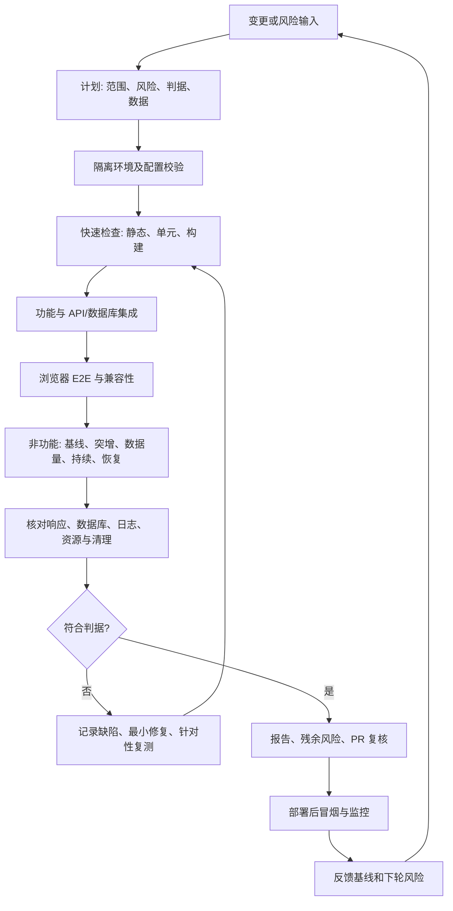

# Living Atlas 工程化测试总览

版本：2026-09-26 初版。适用范围：本仓库的 React 前端、FastAPI 后端、PostgreSQL 数据库及其 Netlify/Render 部署。此文档是测试策略与覆盖清单，不代表列出的未来测试已经完成。每轮具体结果记录于 [本地测试报告](../LivingAtlas1-main/backend/load_tests/TEST_REPORT.md)。

## 1. 目标、边界和质量判据

目标是持续验证：关键用户流程正确、注册与数据保持一致、变化可安全发布、故障后可恢复，并在可代表真实负载的环境中测量性能。测试优先级按用户影响、数据损失风险、变更范围和历史故障排序。当前高优先级路径为注册、地图/卡片读取与筛选、数据上传/删除、数据库连接、前后端配置与启动迁移。

测试分为**测试级别**（单元、组件、API/数据库集成、系统 E2E、验收）和**测试类型**（功能、非功能）。同一个用例可以跨类别，例如并发注册同时验证业务正确性、并发安全与数据完整性。测试结果应给出环境、版本、工作负载、判定依据和限制，避免仅写“通过”。

目前没有经项目所有者确认的生产 SLO、目标并发用户数、峰值时长或代表性数据分布。因此本地 p95 和吞吐量是比较基线，**不是线上容量承诺**。未来应先定义用户可感知的成功率、延迟、数据新鲜度和可用性指标，再设定发布门槛。

## 2. 测试与发布循环

执行原则：一项脚本完成后即运行、核对与修正，再进入下一项；每个缺陷保留失败证据与修复后的回归结果。脚本、产品修复、测试报告按逻辑步骤分别提交。报告、风险与代码一同进入 PR；合并后核对实际部署，不以绿色 GitHub 状态代替线上验证。

| 阶段 | 主要产物 | 进入下一阶段的判据 |
|---|---|---|
| 计划 | 风险清单、测试矩阵、环境/数据/阈值、预计耗时 | 范围与不测项清楚，破坏性操作限定在测试库 |
| 环境 | Git SHA、依赖版本、前后端地址、数据库名、健康查询 | 前端指向本地 API；后端连接隔离测试库；无生产凭据进入测试日志 |
| 实现与执行 | 可重跑脚本、唯一数据前缀、原始结果、应用/数据库日志 | 无意外失败，响应与持久化状态一致；失败被保留并分级 |
| 修复与回归 | 根因、代码提交、重现用例及邻近回归 | 缺陷不再复现；相关路径未回退；间歇性问题有风险记录 |
| 完成与发布 | 报告、残余风险、PR 检查、回滚办法 | 关键数据无残留，部署配置与迁移已复核，发布后有冒烟证据 |

## 3. 环境与数据策略

| 环境 | 用途 | 准入与限制 |
|---|---|---|
| 本地隔离环境 | 开发回归、脚本调试、故障注入、可控数据量 | React `localhost:3000`、FastAPI `127.0.0.1:8000`、PostgreSQL `livingatlas_test`；按 [本地环境指南](../LivingAtlas1-main/backend/LOCAL_TESTING.md) 建立。不可用生产数据库做写入或压力测试。 |
| CI/PR 预览（待建设） | 自动静态、单元、集成、构建与只读 E2E 冒烟 | 独立短命数据库和测试数据；绿色状态需能对应实际执行的检查，不把中性/取消部署视为通过。 |
| 代表性预发布环境（待建设） | 容量、真实数据分布、故障恢复、回滚演练 | 与生产相近的 Render 资源、数据库规格、索引与匿名化数据；定义负载模型与 SLO 后才判定容量。 |
| 生产 | 部署后只读/低影响冒烟、监控 | 不执行高并发、清库或故障注入；检查 Netlify/Render 部署、迁移日志和用户路径。 |

测试数据应合成或去标识化；每轮使用唯一前缀和可审计 ID，执行前后核对行数及约束，最后按前缀清理。故障注入限定在专用测试环境。对外部 ArcGIS、Mapbox、Azure 等服务要注明真实调用还是替身；不可把第三方波动误报为本应用容量。

## 4. 已执行测试与可追溯证据

下表“已执行”仅指 2026-09-26 的本地运行；详细命令、数字、首次失败、修复及局限见 [TEST_REPORT.md](../LivingAtlas1-main/backend/load_tests/TEST_REPORT.md)，运行说明见 [load_tests/README.md](../LivingAtlas1-main/backend/load_tests/README.md)。

| 编号 | 类型 / 级别 | 场景及判定重点 | 状态与证据 | 暴露问题 / 后续 |
|---|---|---|---|---|
| 1 | 功能：注册、数据完整性；非功能：并发；API+DB 集成 | 不同/相同邮箱并发注册；HTTP 结果、行数、`SignupID` 与邮箱唯一性 | 已执行：[脚本](../LivingAtlas1-main/backend/load_tests/01_registration_concurrency.py)、[报告 §1 与注册约束回归](../LivingAtlas1-main/backend/load_tests/TEST_REPORT.md#1-注册正确性与并发) | `MAX+1` ID 竞态；改为 sequence，并在历史数据允许时建立唯一索引。需审计生产历史重复值。 |
| 2 | 非功能：基础负载；功能：读接口回归；API+DB 系统 | 5/10/20 用户混合注册和四个读接口；响应、延迟、数据一致性 | 已执行：[脚本](../LivingAtlas1-main/backend/load_tests/02_baseline_load.py)、[报告 §2](../LivingAtlas1-main/backend/load_tests/TEST_REPORT.md#2-基础负载) | 请求时 DDL 锁等待、共享游标冲突和一次未稳定复现的超时；核心路径已改造。 |
| 3 | 非功能：突增与恢复；API+DB 系统 | 5→50→5 用户短时变化；错误率、p95/p99、恢复 | 已执行：[脚本](../LivingAtlas1-main/backend/load_tests/03_spike.py)、[报告 §3](../LivingAtlas1-main/backend/load_tests/TEST_REPORT.md#3-流量突增) | 后续回归出现偶发 15 秒超时，原因未定位；短突增不能证明持续峰值容量。 |
| 4 | 非功能：数据量/性能；功能：分页正确性；API+DB 系统 | 100/1,000/5,000 卡片，全量与前两页响应；条数与重复 ID | 已执行：[脚本](../LivingAtlas1-main/backend/load_tests/04_data_volume.py)、[报告 §4](../LivingAtlas1-main/backend/load_tests/TEST_REPORT.md#4-大量数据) | 全量响应成本随规模上升；API 已加可选分页，前端仍使用全量数据，浏览器渲染未测。 |
| 5a | 非功能：稳定性/持续运行；API+DB 系统 | 五分钟混合请求，成功率、延迟、连接数与数据清理 | 已执行：[脚本](../LivingAtlas1-main/backend/load_tests/05a_soak.py)、[报告 §5](../LivingAtlas1-main/backend/load_tests/TEST_REPORT.md#5-持续运行与故障恢复) | 原版完成 300 秒；后续改动只做 60 秒综合回归，需重跑完整持续测试。 |
| 5b | 非功能：可靠性/故障恢复；功能：事务正确性；API+DB 系统 | 终止专用 DB 会话后连续读取和注册，检查自动恢复 | 已执行：[脚本](../LivingAtlas1-main/backend/load_tests/05b_connection_recovery.py)、[报告 §5 与连接隔离回归](../LivingAtlas1-main/backend/load_tests/TEST_REPORT.md#5-持续运行与故障恢复) | 修复前首次请求失败；核心读/注册路径使用池并复测。旧模块级连接路径、整库停机与事务中断仍未覆盖。 |

已存在的其他测试资产包括 [前端 `main.test.js`](../LivingAtlas1-main/client/src/__tests__/main.test.js) 与 [后端 Azure 上传/删除测试](../LivingAtlas1-main/backend/tests/test_azure_upload_delete.py)；本轮未执行或评估其覆盖率，不能将它们标为本轮通过。

## 5. 下一阶段测试矩阵

| 类型 | 优先级 | 候选场景与可判定结果 | 推荐自动化层 |
|---|---|---|---|
| 功能：注册/认证/授权 | 高 | 输入边界、重复/大小写邮箱、权限提升、会话失效、未授权访问；核对状态码和数据库不变量 | 单元 + API 集成 + 少量 E2E |
| 功能：卡片与地图 | 高 | 创建/编辑/删除卡片，筛选组合、排序/分页、空结果、地图点位与列表一致、并发更新 | API/DB 集成 + 浏览器 E2E |
| 功能：文件与外部集成 | 高 | 上传大小/格式、删除回滚、Azure 故障、ArcGIS 响应异常、Mapbox 超时；无孤儿文件/记录 | 合约测试 + 集成测试 |
| 功能：端到端用户旅程 | 高 | 注册→登录→浏览地图→筛选→卡片详情→上传/编辑；校验前后端环境连接 | Playwright 等浏览器自动化；生产只做低影响冒烟 |
| 非功能：安全 | 高 | 按 [OWASP ASVS](https://owasp.org/projects/asvs) 建需求清单；认证授权、SQL 注入、XSS、上传、密钥、依赖扫描 | 静态/依赖扫描 + API 安全测试 + 人工复核 |
| 非功能：迁移与数据完整性 | 高 | 带历史重复 ID/邮箱和大表的迁移、幂等重启、并发 worker 启动、备份与回滚 | 隔离 DB 集成 + 预发布演练 |
| 非功能：性能/容量 | 高 | 代表性数据和读写比例下的阶梯负载、峰值保持、极限压力、瓶颈与连接池观测 | 预发布环境专用负载工具 |
| 非功能：可靠性 | 高 | 长时间 soak、数据库整体短停、事务中断、第三方故障、重试与恢复时间 | 预发布故障注入 + 监控 |
| 非功能：可访问性 | 中 | 键盘、焦点、表单提示、颜色对比、地图替代信息；按 [WCAG 2.2](https://www.w3.org/TR/WCAG22/) 选目标级别 | 自动扫描 + 人工辅助技术检查 |
| 非功能：兼容性/响应式 | 中 | 主流浏览器、移动视口、慢网与地图交互 | 浏览器矩阵 E2E + 视觉抽查 |
| 非功能：可用性/可观察性 | 中 | 真实任务完成率、前端错误、API 日志关联、SLO 仪表盘与告警 | 人工任务测试 + 监控验证 |

优先实施顺序：先补稳定、快速的注册和数据库集成回归，再做关键浏览器 E2E 与迁移演练；其后建立代表性预发布负载模型，最后扩展长时间与故障组合测试。每项新增自动化先小样本运行，记录真实结果后才纳入 CI 门槛。

## 6. 判定、缺陷与报告规范

- **功能正确性门槛：** 关键流程无意外失败；预期业务拒绝单独计数；HTTP 响应、数据库状态及副作用一致；测试数据零残留。安全或数据损坏类缺陷优先阻断发布。
- **性能门槛：** 先由产品和运维批准 SLI/SLO、用户模型、目标环境、峰值持续时间及资源预算；再设成功率、p95/p99、吞吐、数据库连接/CPU/内存阈值。未批准前只作趋势比较，不以任意数字宣称“达标”。
- **缺陷分级：** 记录复现步骤、环境/SHA、请求样本、预期/实际、日志、影响范围、频率和证据链接。间歇性超时保持开放风险；重新运行通过不等于根因已解决。
- **报告字段：** 测试目的与版本、范围/不测项、环境、依赖、数据、脚本命令、负载曲线、样本量、分位数与错误数、数据库核对、清理、失败/修复/回归、风险、结论和复核人。不要只写总请求成功率。
- **发布检查：** 复核 Git 差异与秘密文件、Netlify 前端 API 默认地址、Render `DATABASE_URL`、生产历史数据迁移、PR 检查和回滚。合并后以实际 Netlify/Render 部署及用户路径冒烟为准；取消的预览部署不算预览测试通过。

## 7. 建议执行频率与责任

下表是后续工程化目标，并非当前已经启用的 CI 规则。测试负责人应在每轮计划中按变更风险调整范围；发布负责人决定风险是否可接受。

| 触发点 | 建议执行 | 主要责任与留存证据 |
|---|---|---|
| 每次相关代码改动 | 静态检查、受影响单元/组件测试、快速 API/DB 集成用例 | 实施者保存命令、Git SHA 与失败日志；缺陷修复后重跑相关回归。 |
| 每个 PR | 前端构建、关键注册/读取回归、迁移兼容性检查、秘密文件扫描 | PR 作者附测试结果与残余风险；审查者核对代码、数据影响及报告。 |
| 定期或重大性能改动 | 代表性数据量、阶梯负载、突增、持续运行和连接/资源曲线 | 测试负责人比较基线和波动，并保留原始采样；超出约定阈值时调查。 |
| 发布前 | 关键浏览器 E2E、预发布迁移/回滚演练、容量与安全检查 | 发布负责人确认版本、环境、SLO 和回滚准备。 |
| 发布后 | 低影响冒烟、Netlify/Render 部署与日志、用户指标与告警 | 运维/发布负责人记录实际部署版本及异常，并将新风险加入下一轮计划。 |

为建立需求到证据的追溯，新增用例建议使用稳定编号（如 `REG-01`、`CARD-01`、`REL-01`），在 PR/报告中关联需求或缺陷、脚本路径、运行 SHA、结果和后续任务。对未执行、被跳过或环境不具代表性的用例明确标注，不能计入通过率。

## 8. 方法依据

本策略以 [ISTQB CTFL v4.0.1](https://www.istqb.org/certifications/certified-tester-foundation-level-ctfl-v4-0/) 的计划、分析设计、实施执行、监控控制与完成活动组织循环；用 [ISO/IEC 25010:2023](https://www.iso.org/standard/78176.html) 的产品质量模型提示非功能覆盖面。安全与可访问性分别参考 [OWASP ASVS](https://owasp.org/projects/asvs) 和 [W3C WCAG 2.2](https://www.w3.org/TR/WCAG22/)；生产可靠性目标可参考 [Google SRE 的 SLO 方法](https://sre.google/workbook/implementing-slos/)。这些是测试设计依据，并不表示本应用已获得对应标准认证。
